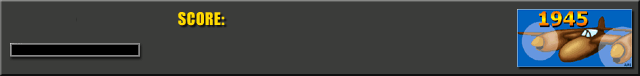
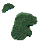
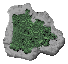
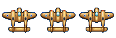

# Project 1945 by Aredna

Project 1945 is a game based on the old videogame [1945: The Final Front](https://www.youtube.com/watch?v=uBIbxobSUcY) of the 2002. It's a top down scroller game made with SDL2, CMake and programmed in C as a project of study for the Italian Videogames Academy for the 3rd year course of Videogames programming.

## User Guide

In the Release tab, you will find the Game download link if you want to play the game (with a little of bug :yum:).

## Developer Guidelines

Install clang as compiler.
Install CMake and use the compiling kit inside Visual Studio Code named amd64 to make builds.
Inside Visual Studio Code make a Delete Cache and Reconfigure to refresh the project's paths.

## Game Description
In Project 1945 you will be able to play in a 640x480 resolution adventure.
In the game's window you will find the game's name.
In the Main Menu  there will be 2 text "START A GAME" and "QUIT THE GAME". Pressing the "MOUSE LEFT BUTTON" on the text "START A GAME" will let you start the game, while pressine the "QUIT THE GAME" text you will close it. 
Pressing the "ESCAPE" button on your keyboard, will let you quit the application, in any moment.

In the game scene, on the bottom of the screen you will see an Info Panel about the current game's parameters:
- A lifes Counter in the bottom left corner (sometimes this one doesn't appear):  
•) You have a maximum of 4 lifes.   
•) The lifes can be lost when your energy bar reachs the 0 or above.
•) When you lose a life you will be unable to move your Plane, and you will be untouchable, for some seconds and it will blink for the same amount of time.
•) When you will lose all your lifes, your plane will EXPLODE and the game will be restarted after 2 seconds!

- An energy bar, below the lifes counter (sometimes this one decide to take all the left part of the screen :scream:):  
•) Every time it is empty, you will lose 1 life.  
•) You lose energy when you are hit by the enemy and his bullets.

- a Score Counter, in the bottom middle part of the screen:
•) You will receive score points every time you destroy another plane or enemy bullets.

Losing all your lifes will let the game restart, if you want to quit and close the game just press the "ESCAPE" button.
During the game planes and islands will be spawned in the top part of the screen and they will move to the bottom part of the screen.

### There are 3 types of island and they are spawned at random. 
.  
 

## Controls

### Player 
-Player movements: Arrow Keys

-Shoot: Space bar/ X Key
•) For someone shooting with the space bar could cause an anomaly for the movement caused by the keyboard called "key rollover" or "anti ghosting". So for someone with this kind of problem like me, you can shoot with the "X" key. 

## Copyright
Attribution-NonCommercial-ShareAlike 4.0 International (CC BY-NC-SA 4.0) 
 
